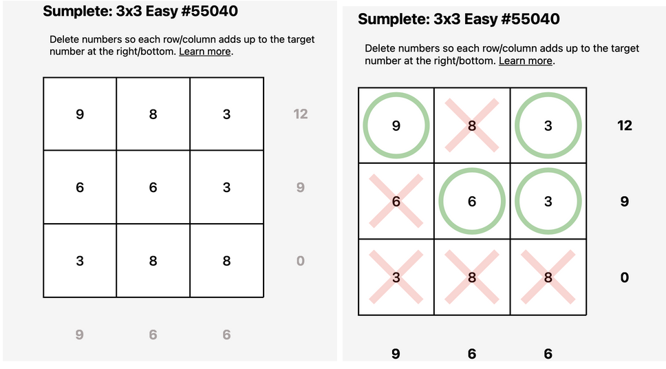
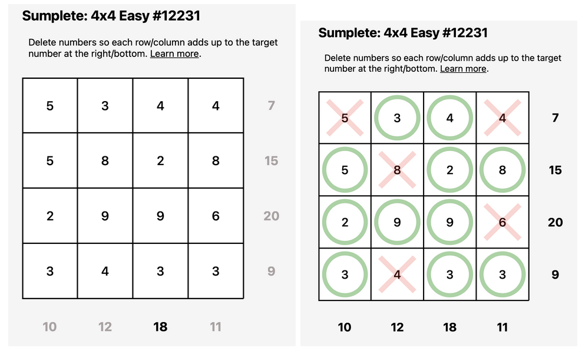
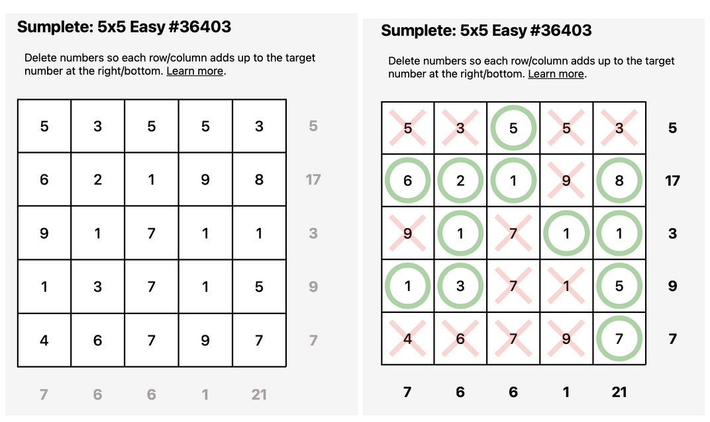
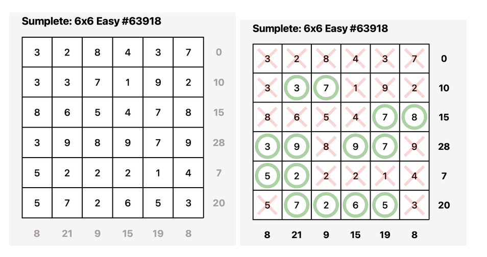

# Sumplete Solver

## Project Overview

This repository houses an implementation of a Sumplete Solver, a Python-based solution for Sumplete puzzles—a number game where players fill a grid based on row and column sums while adhering to specific constraints.

**Celestial Convergence:**

Through the Mystical Logic Portal, witness the transcendence of numbers and constraints, converging in a cosmic dance to unveil the secrets of Sumplete's enigmatic puzzles. Embark on a journey where logical realms intertwine with celestial wonders, guiding us through the captivating landscape of AI-driven puzzle-solving.

# Sumplete: The Game and Its Origin

## Sumplete Overview

Sumplete is a logic-based number game where players fill a grid based on row and column sums while adhering to specific constraints. The game was introduced through the Sumplete website([https://sumplete.com/](https://sumplete.com/)), offering various puzzles of different sizes and difficulties. As an AI invention, Sumplete showcases the creativity of AI models like ChatGPT in designing engaging games.

## Creation and Concept

While technically, ChatGPT doesn't invent anything as a stochastic parrot, it demonstrates the capability of AI to generate novel concepts and rule sets. Sumplete combines elements of puzzle-solving and constraint satisfaction problems, making it an interesting challenge for AI enthusiasts and players alike.
READ MORE: [https://sumplete.com/about/](https://sumplete.com/about/)

# Sumplete Rules

Sumplete follows a simple set of rules, combining elements of Sudoku and Kakuro:

1. **Grid:** The game is played on a square grid, divided into cells.
2. **Numbers:** Players use numbers (1 to N, where N is the grid size) to fill the cells.
3. **Constraints:** Each row and column has associated sum constraints.
4. **Objective:** The goal is to fill the grid in a way that satisfies the row and column sum constraints.
5. **Elimination:** Numbers can be eliminated from cells based on constraint violations.
6. **Winning:** A valid solution is achieved when all constraints are satisfied.

Understanding these rules is crucial for formulating Sumplete as a constraint satisfaction problem and applying solving algorithms. The combination of logical deduction and backtracking makes Sumplete an intriguing challenge for both AI and human players.

## Team Members - Foos Who Code

* Abel Mendoza
* Bharti Moryani
* [Team Member 3]
* [Team Member 4]
* [Team Member 5]

## Course Information

* **Course** : CPSC 481 - Artificial Intelligence
* **Section** : 05
* **Semester** : Fall 2023
* Professor : Kenytt Avery

## Project Structure

* `sumplete.py`: Main Python script containing the SumpleteSolver class implementation.
* `README.md`: This file, providing an overview of the project.

## Grids Used

## 3x3

## 4x4

## 5x5

## 6x6

### Getting Started
## Variables, Domains and Constraints

# 3 X 3 Puzzle

| G1 | G2 | G3 | S1 |
|----|----|----|----|
| G4 | G5 | G6 | S2 |
| G7 | G8 | G9 | S3 |

| S4 | S5 | S6 |
|----|----|----|

Let G1-G9 represents grid position and S1-S3 are targeted row sum and S4-S6 are targeted column sum.

# Variables
 {G1, G2, G3, G4, G5, G6, G7, G8, G9}

# Domain for 3 X 3
G1: {V1,0}
G2: {V2,0}
G3: {V3,0}
G4: {V4,0}
G5: {V5,0}
G6: {V6,0}
G7: {V7,0}
G8: {V8,0}
G9: {V9,0}
Where V1, V2, V3, V4, V5, V6, V7, V8, V9 are the original values in the grid.

# Constraints

### Unary
- Each grid can either have 0 or V where V is the original value in the grid.
### Binary

1. G1 + G2 + G3 = S1
2. G1 + G4 + G7 = S4
3. G4 + G5 + G6 = S2
4. G2 + G5 + G8 = S5
5. G7 + G8 + G9 = S3
6. G3 + G6 + G9 = S6

## Constraint Graph

## Documentation

Project Guidelines: [https://docs.google.com/document/d/18OP_GsF_aYSSRWobFfqXCMx3myt1GoHwXu5R68DS7LM/edit?usp=sharing

](https://docs.google.com/document/d/18OP_GsF_aYSSRWobFfqXCMx3myt1GoHwXu5R68DS7LM/edit?usp=sharing)

## Acknowledgements

We would like to express our sincere gratitude to Professor Kenytt Avery for his invaluable guidance and support throughout the development of this project. His expertise and insights have been instrumental in shaping our understanding of artificial intelligence and constraint satisfaction problems.

We also extend our thanks to the creators of the Sumplete game for providing the foundation for our project. Additionally, our appreciation goes to the CPSC 481 - Artificial Intelligence course for fostering an environment that encourages exploration and innovation.

## License

This project is licensed under the MIT License.
